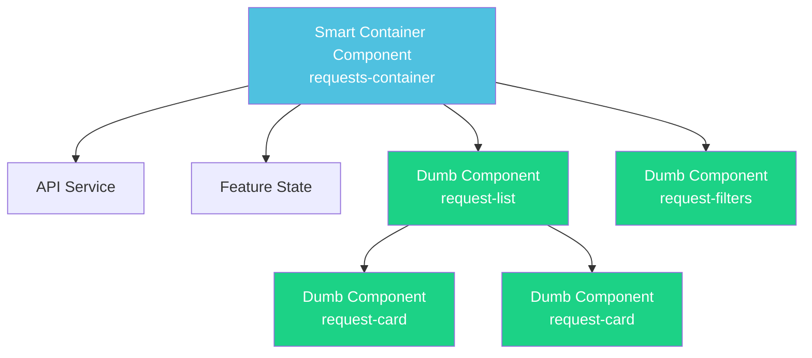

# Angular 20 Architecture Recommendations

> Modernizing from Angular 7/8 to Angular 20: Best Practices and Structural Improvements

---

## Table of Contents

- [Current Architecture Analysis](#current-architecture-analysis)
- [Recommended Modern Architecture](#recommended-modern-architecture)
- [Key Improvements](#key-improvements)
- [Detailed Recommendations](#detailed-recommendations)
- [Migration Strategy](#migration-strategy)
- [Implementation Examples](#implementation-examples)

---

## Current Architecture Analysis

### Current Structure (Angular 7/8 Pattern)

```
src/app/
├── components/          # Shared components (flat structure)
├── pages/              # Feature pages (mixed concerns)
├── services/           # All services in one place
│   ├── requests/       # Auth + Data service (monolithic)
│   ├── guards/
│   ├── interceptors/
│   └── helpers/
├── models/             # Single models folder
├── constants/          # Global constants
└── shared/             # Shared module
```

### Issues with Current Structure

1. **Monolithic Service Layer**
   - `DataService` has 30+ methods handling multiple domains
   - Hard to maintain and test
   - Violates Single Responsibility Principle

2. **Lack of Feature Modules**
   - Components scattered between `pages/` and `components/`
   - No clear feature boundaries
   - Difficult to lazy load features

3. **Mixed Module Strategy**
   - Hybrid NgModule + Standalone components
   - Inconsistent patterns across codebase
   - Confusing dependency management

4. **Flat Component Structure**
   - No distinction between Smart/Dumb components
   - Business logic mixed in presentation components

5. **Global State Management**
   - BehaviorSubjects scattered across services
   - No centralized state strategy
   - Potential for state inconsistencies

6. **No Signal Support**
   - Using RxJS for everything (pre-Angular 16 pattern)
   - Missing out on Angular Signals benefits

---

## Recommended Modern Architecture (Angular 20)

### Proposed Structure

```
src/app/
│
├── core/                           # Singleton services, guards, interceptors
│   ├── auth/
│   │   ├── guards/
│   │   │   ├── auth.guard.ts
│   │   │   ├── dealer.guard.ts
│   │   │   └── client.guard.ts
│   │   ├── interceptors/
│   │   │   └── auth.interceptor.ts
│   │   ├── services/
│   │   │   ├── auth.service.ts
│   │   │   └── token-storage.service.ts
│   │   └── models/
│   │       └── user.model.ts
│   │
│   ├── http/
│   │   ├── interceptors/
│   │   │   ├── error.interceptor.ts
│   │   │   └── api-url.interceptor.ts
│   │   └── services/
│   │       └── http-client.service.ts
│   │
│   ├── config/
│   │   ├── app.config.ts
│   │   ├── theme.config.ts
│   │   └── environment.service.ts
│   │
│   ├── layout/
│   │   ├── services/
│   │   │   ├── layout.service.ts
│   │   │   └── breakpoint.service.ts
│   │   └── models/
│   │       └── breakpoint.model.ts
│   │
│   └── core.providers.ts           # Core services provider function
│
├── features/                       # Feature modules (lazy-loaded)
│   │
│   ├── car-selection/
│   │   ├── components/
│   │   │   ├── car-selector-container/    # Smart component
│   │   │   ├── producer-list/             # Dumb component
│   │   │   ├── model-selector/            # Dumb component
│   │   │   ├── version-selector/          # Dumb component
│   │   │   ├── fuel-selector/             # Dumb component
│   │   │   └── engine-selector/           # Dumb component
│   │   ├── services/
│   │   │   ├── car-data.service.ts
│   │   │   └── car-selection.state.ts     # Feature state
│   │   ├── models/
│   │   │   ├── car.model.ts
│   │   │   ├── producer.model.ts
│   │   │   └── engine.model.ts
│   │   ├── resolvers/
│   │   │   └── producers.resolver.ts
│   │   ├── validators/
│   │   │   └── car-selection.validators.ts
│   │   ├── car-selection.routes.ts
│   │   └── index.ts                       # Public API
│   │
│   ├── requests/
│   │   ├── components/
│   │   │   ├── requests-container/        # Smart component
│   │   │   ├── request-list/              # Dumb component
│   │   │   ├── request-card/              # Dumb component
│   │   │   └── request-filters/           # Dumb component
│   │   ├── services/
│   │   │   ├── request.service.ts
│   │   │   └── request.state.ts
│   │   ├── models/
│   │   │   └── request.model.ts
│   │   ├── requests.routes.ts
│   │   └── index.ts
│   │
│   ├── messaging/
│   │   ├── components/
│   │   │   ├── message-container/         # Smart component
│   │   │   ├── message-list/              # Dumb component
│   │   │   ├── message-input/             # Dumb component
│   │   │   └── file-attachment/           # Dumb component
│   │   ├── services/
│   │   │   ├── message.service.ts
│   │   │   ├── message.state.ts
│   │   │   └── file.service.ts
│   │   ├── models/
│   │   │   └── message.model.ts
│   │   ├── directives/
│   │   │   └── auto-scroll.directive.ts
│   │   ├── messaging.routes.ts
│   │   └── index.ts
│   │
│   ├── user-management/
│   │   ├── components/
│   │   │   ├── profile-container/
│   │   │   ├── profile-form/
│   │   │   └── avatar-upload/
│   │   ├── services/
│   │   │   ├── user.service.ts
│   │   │   └── user.state.ts
│   │   ├── models/
│   │   │   └── user-profile.model.ts
│   │   ├── user-management.routes.ts
│   │   └── index.ts
│   │
│   ├── subscription/
│   │   ├── components/
│   │   │   ├── subscription-container/
│   │   │   ├── package-list/
│   │   │   ├── package-card/
│   │   │   └── credit-display/
│   │   ├── services/
│   │   │   ├── subscription.service.ts
│   │   │   ├── payment.service.ts
│   │   │   └── subscription.state.ts
│   │   ├── models/
│   │   │   ├── package.model.ts
│   │   │   └── transaction.model.ts
│   │   ├── subscription.routes.ts
│   │   └── index.ts
│   │
│   ├── auth/
│   │   ├── components/
│   │   │   ├── login/
│   │   │   ├── register/
│   │   │   ├── register-client-form/
│   │   │   ├── register-dealer-form/
│   │   │   └── password-reset/
│   │   ├── services/
│   │   │   └── auth-ui.service.ts         # Feature-specific
│   │   ├── validators/
│   │   │   └── auth.validators.ts
│   │   ├── auth.routes.ts
│   │   └── index.ts
│   │
│   └── admin/
│       ├── components/
│       │   ├── admin-dashboard/
│       │   ├── data-management/
│       │   └── statistics/
│       ├── services/
│       │   ├── admin.service.ts
│       │   └── admin.state.ts
│       ├── models/
│       │   └── admin-data.model.ts
│       ├── admin.routes.ts
│       └── index.ts
│
├── shared/                         # Shared code across features
│   │
│   ├── components/                 # Reusable dumb components
│   │   ├── ui/
│   │   │   ├── button/
│   │   │   ├── card/
│   │   │   ├── modal/
│   │   │   └── loader/
│   │   └── form/
│   │       ├── input/
│   │       ├── select/
│   │       └── file-upload/
│   │
│   ├── directives/
│   │   ├── auto-focus.directive.ts
│   │   ├── click-outside.directive.ts
│   │   └── lazy-load.directive.ts
│   │
│   ├── pipes/
│   │   ├── currency.pipe.ts
│   │   ├── date-format.pipe.ts
│   │   └── truncate.pipe.ts
│   │
│   ├── utils/
│   │   ├── form.utils.ts
│   │   ├── date.utils.ts
│   │   └── array.utils.ts
│   │
│   ├── validators/
│   │   └── common.validators.ts
│   │
│   ├── constants/
│   │   ├── app.constants.ts
│   │   ├── api.constants.ts
│   │   └── route.constants.ts
│   │
│   ├── models/
│   │   ├── common.model.ts
│   │   └── api-response.model.ts
│   │
│   └── types/
│       ├── common.types.ts
│       └── utility.types.ts
│
├── layout/                         # Layout components
│   ├── components/
│   │   ├── main-layout/
│   │   ├── header/
│   │   ├── footer/
│   │   ├── sidebar/
│   │   └── navigation/
│   └── layout.routes.ts
│
├── app.component.ts               # Root component (minimal)
├── app.routes.ts                  # Root routes
└── app.config.ts                  # Application configuration

```

---

## Key Improvements

### 1. Feature-Based Architecture

**Old Approach** (Angular 7/8):
```
src/app/
├── components/        # All components together
├── pages/            # All pages together
└── services/         # All services together
```

**New Approach** (Angular 20):
```
src/app/
└── features/
    ├── car-selection/     # Everything for car selection
    │   ├── components/
    │   ├── services/
    │   └── models/
    └── messaging/         # Everything for messaging
        ├── components/
        ├── services/
        └── models/
```

**Benefits**:
- **Cohesion**: Related code stays together
- **Lazy Loading**: Easy to lazy load entire features
- **Team Scalability**: Teams can own features
- **Maintainability**: Changes isolated to feature folders
- **Testability**: Feature tests self-contained

---

### 2. Smart/Dumb Component Pattern



**Smart Components (Containers)**:
- Inject services
- Manage state
- Handle side effects
- Pass data to dumb components via @Input
- Receive events from dumb components via @Output

**Dumb Components (Presentational)**:
- Only @Input/@Output
- No service injection
- Pure presentation logic
- Highly reusable
- Easy to test

**Example**:

```typescript
// Smart Container Component
@Component({
  selector: 'app-requests-container',
  standalone: true,
  template: `
    <app-request-filters
      [filters]="filters()"
      (filterChange)="onFilterChange($event)"
    />

    <app-request-list
      [requests]="requests()"
      [loading]="loading()"
      (requestSelected)="onRequestSelected($event)"
    />
  `
})
export class RequestsContainerComponent {
  private requestService = inject(RequestService);

  // Angular Signals (modern reactive primitive)
  requests = this.requestService.requests;
  loading = this.requestService.loading;
  filters = signal<RequestFilters>({});

  onFilterChange(filters: RequestFilters) {
    this.filters.set(filters);
    this.requestService.loadRequests(filters);
  }

  onRequestSelected(request: Request) {
    this.router.navigate(['/messages', request.id]);
  }
}

// Dumb Component
@Component({
  selector: 'app-request-list',
  standalone: true,
  template: `
    @if (loading()) {
      <app-loader />
    } @else {
      @for (request of requests(); track request.id) {
        <app-request-card
          [request]="request"
          (click)="requestSelected.emit(request)"
        />
      }
    }
  `
})
export class RequestListComponent {
  requests = input.required<Request[]>();
  loading = input<boolean>(false);
  requestSelected = output<Request>();
}
```

---

### 3. Service Organization by Domain

**Current** (Monolithic):
```typescript
// data.service.ts - 30+ methods
class DataService {
  getProducers() { }
  getCarsByProducer() { }
  getRequests() { }
  sendMessage() { }
  buyPackage() { }
  getUserData() { }
  // ... 25+ more methods
}
```

**Recommended** (Domain-Driven):
```typescript
// features/car-selection/services/car-data.service.ts
@Injectable()
export class CarDataService {
  getProducers() { }
  getCarsByProducer() { }
  getVersionsByCar() { }
  getEnginesByVersion() { }
}

// features/requests/services/request.service.ts
@Injectable()
export class RequestService {
  getRequests() { }
  createRequest() { }
  updateRequest() { }
  deleteRequest() { }
}

// features/messaging/services/message.service.ts
@Injectable()
export class MessageService {
  getMessages() { }
  sendMessage() { }
  uploadFile() { }
  downloadFile() { }
}

// features/subscription/services/subscription.service.ts
@Injectable()
export class SubscriptionService {
  getPackages() { }
  buyPackage() { }
  getTransactions() { }
}
```

**Benefits**:
- Smaller, focused services
- Easier to test
- Clear boundaries
- Can be lazy loaded with features

---

### 4. Modern State Management with Signals

**Old Approach** (RxJS BehaviorSubjects):
```typescript
export class DataService {
  private messagesSubject = new BehaviorSubject<Message[]>([]);
  public messagesObs$ = this.messagesSubject.asObservable();

  loadMessages() {
    this.http.get('/messages').subscribe(messages => {
      this.messagesSubject.next(messages);
    });
  }
}
```

**New Approach** (Angular Signals):
```typescript
export class MessageState {
  private http = inject(HttpClient);

  // Signals for reactive state
  messages = signal<Message[]>([]);
  loading = signal<boolean>(false);
  error = signal<string | null>(null);

  // Computed signals
  unreadCount = computed(() =>
    this.messages().filter(m => !m.read).length
  );

  sortedMessages = computed(() =>
    [...this.messages()].sort((a, b) =>
      b.timestamp - a.timestamp
    )
  );

  // Effects for side effects
  constructor() {
    effect(() => {
      console.log('Messages updated:', this.messages().length);
    });
  }

  async loadMessages() {
    this.loading.set(true);
    this.error.set(null);

    try {
      const messages = await firstValueFrom(
        this.http.get<Message[]>('/messages')
      );
      this.messages.set(messages);
    } catch (err) {
      this.error.set('Failed to load messages');
    } finally {
      this.loading.set(false);
    }
  }

  addMessage(message: Message) {
    this.messages.update(messages => [...messages, message]);
  }

  markAsRead(messageId: string) {
    this.messages.update(messages =>
      messages.map(m =>
        m.id === messageId ? { ...m, read: true } : m
      )
    );
  }
}
```

**Benefits**:
- Simpler mental model
- Better performance (fine-grained reactivity)
- No need for async pipe in templates
- Automatic change detection
- Computed values automatically update
- No subscription management needed

---

### 5. Standalone Components (Full Migration)

**Old Approach** (NgModules):
```typescript
@NgModule({
  declarations: [RequestsComponent, RequestListComponent],
  imports: [CommonModule, PrimeNGModules],
  exports: [RequestsComponent]
})
export class RequestsModule { }
```

**New Approach** (Standalone):
```typescript
// requests-container.component.ts
@Component({
  selector: 'app-requests-container',
  standalone: true,
  imports: [
    RequestListComponent,
    RequestFiltersComponent,
    ButtonModule,
    CardModule
  ],
  templateUrl: './requests-container.component.html'
})
export class RequestsContainerComponent { }

// app.routes.ts
export const routes: Routes = [
  {
    path: 'requests',
    loadComponent: () => import('./features/requests/components/requests-container/requests-container.component')
      .then(m => m.RequestsContainerComponent)
  }
];
```

**Benefits**:
- No NgModules needed
- Better tree-shaking
- Lazy load individual components
- Clearer dependencies
- Simpler mental model

---

### 6. Modern Dependency Injection

**Old Approach**:
```typescript
export class RequestsComponent {
  constructor(
    private dataService: DataService,
    private authService: AuthService,
    private router: Router,
    private activatedRoute: ActivatedRoute,
    private messageService: MessageService
  ) { }
}
```

**New Approach** (inject function):
```typescript
export class RequestsContainerComponent {
  private requestService = inject(RequestService);
  private authService = inject(AuthService);
  private router = inject(Router);
  private route = inject(ActivatedRoute);
  private toastService = inject(ToastService);

  // Can inject conditionally
  private analyticsService = inject(AnalyticsService, { optional: true });

  // Can inject in methods
  private getLoggerService() {
    return inject(LoggerService);
  }
}
```

**Benefits**:
- Cleaner code
- Can inject outside constructor
- Conditional injection
- Better for testing

---

### 7. Feature State Management

Each feature manages its own state:

```typescript
// features/car-selection/services/car-selection.state.ts
@Injectable()
export class CarSelectionState {
  private http = inject(HttpClient);

  // State signals
  producers = signal<Producer[]>([]);
  selectedProducer = signal<Producer | null>(null);

  cars = signal<Car[]>([]);
  selectedCar = signal<Car | null>(null);

  versions = signal<Version[]>([]);
  selectedVersion = signal<Version | null>(null);

  engines = signal<Engine[]>([]);
  selectedEngine = signal<Engine | null>(null);

  loading = signal<boolean>(false);

  // Computed
  isComplete = computed(() =>
    !!this.selectedProducer() &&
    !!this.selectedCar() &&
    !!this.selectedVersion() &&
    !!this.selectedEngine()
  );

  selectionSummary = computed(() => ({
    producer: this.selectedProducer()?.name,
    car: this.selectedCar()?.model,
    version: this.selectedVersion()?.name,
    engine: this.selectedEngine()?.spec
  }));

  // Actions
  async loadProducers() {
    this.loading.set(true);
    const producers = await firstValueFrom(
      this.http.get<Producer[]>('/producers')
    );
    this.producers.set(producers);
    this.loading.set(false);
  }

  selectProducer(producer: Producer) {
    this.selectedProducer.set(producer);
    this.loadCars(producer.id);
  }

  async loadCars(producerId: string) {
    this.loading.set(true);
    const cars = await firstValueFrom(
      this.http.get<Car[]>(`/cars/${producerId}`)
    );
    this.cars.set(cars);
    this.loading.set(false);
  }

  reset() {
    this.selectedProducer.set(null);
    this.selectedCar.set(null);
    this.selectedVersion.set(null);
    this.selectedEngine.set(null);
  }
}
```

---

### 8. Route Configuration

**Old Approach** (Centralized NgModule routing):
```typescript
// app-routing.module.ts
const routes: Routes = [
  { path: 'home', component: HomeComponent },
  { path: 'login', component: LoginComponent },
  { path: 'requests', component: RequestsComponent },
  // ... 20+ routes
];

@NgModule({
  imports: [RouterModule.forRoot(routes)],
  exports: [RouterModule]
})
export class AppRoutingModule { }
```

**New Approach** (Feature-based routes):
```typescript
// app.routes.ts (root)
export const APP_ROUTES: Routes = [
  {
    path: '',
    component: MainLayoutComponent,
    children: [
      {
        path: '',
        loadComponent: () => import('./features/home/home.component')
          .then(m => m.HomeComponent)
      },
      {
        path: 'cars',
        loadChildren: () => import('./features/car-selection/car-selection.routes')
          .then(m => m.CAR_SELECTION_ROUTES)
      },
      {
        path: 'requests',
        loadChildren: () => import('./features/requests/requests.routes')
          .then(m => m.REQUEST_ROUTES),
        canActivate: [authGuard, dealerGuard]
      },
      {
        path: 'messages',
        loadChildren: () => import('./features/messaging/messaging.routes')
          .then(m => m.MESSAGING_ROUTES),
        canActivate: [authGuard]
      }
    ]
  },
  {
    path: 'auth',
    loadChildren: () => import('./features/auth/auth.routes')
      .then(m => m.AUTH_ROUTES)
  }
];

// features/car-selection/car-selection.routes.ts
export const CAR_SELECTION_ROUTES: Routes = [
  {
    path: '',
    component: CarSelectorContainerComponent,
    resolve: {
      producers: producersResolver
    }
  }
];

// features/requests/requests.routes.ts
export const REQUEST_ROUTES: Routes = [
  {
    path: '',
    component: RequestsContainerComponent
  },
  {
    path: ':id',
    component: RequestDetailComponent
  }
];
```

---

### 9. Functional Guards and Interceptors

**Old Approach** (Class-based):
```typescript
@Injectable()
export class AuthGuard implements CanActivate {
  constructor(
    private authService: AuthService,
    private router: Router
  ) {}

  canActivate(): boolean {
    if (this.authService.isAuthenticated()) {
      return true;
    }
    this.router.navigate(['/login']);
    return false;
  }
}
```

**New Approach** (Functional):
```typescript
// core/auth/guards/auth.guard.ts
export const authGuard: CanActivateFn = (route, state) => {
  const authService = inject(AuthService);
  const router = inject(Router);

  if (authService.isAuthenticated()) {
    return true;
  }

  return router.createUrlTree(['/auth/login'], {
    queryParams: { returnUrl: state.url }
  });
};

export const dealerGuard: CanActivateFn = () => {
  const authService = inject(AuthService);
  const router = inject(Router);

  const user = authService.currentUser();
  if (user?.role === 'DEALER') {
    return true;
  }

  return router.createUrlTree(['/']);
};

// Composable guards
export const dealerAuthGuard: CanActivateFn = (route, state) => {
  return authGuard(route, state) && dealerGuard(route, state);
};
```

**Functional Interceptors**:
```typescript
// core/http/interceptors/auth.interceptor.ts
export const authInterceptor: HttpInterceptorFn = (req, next) => {
  const tokenStorage = inject(TokenStorageService);
  const token = tokenStorage.getToken();

  if (token) {
    req = req.clone({
      setHeaders: {
        Authorization: `Bearer ${token}`
      }
    });
  }

  return next(req);
};

// core/http/interceptors/error.interceptor.ts
export const errorInterceptor: HttpInterceptorFn = (req, next) => {
  const router = inject(Router);
  const toastService = inject(ToastService);
  const authService = inject(AuthService);

  return next(req).pipe(
    catchError((error: HttpErrorResponse) => {
      if (error.status === 401) {
        authService.logout();
        router.navigate(['/auth/login']);
      } else if (error.status === 403) {
        toastService.error('Access denied');
      } else {
        toastService.error('An error occurred');
      }
      return throwError(() => error);
    })
  );
};

// app.config.ts
export const appConfig: ApplicationConfig = {
  providers: [
    provideHttpClient(
      withInterceptors([authInterceptor, errorInterceptor])
    )
  ]
};
```

---

### 10. Modern Control Flow (@if, @for, @switch)

**Old Approach** (*ngIf, *ngFor):
```html
<div *ngIf="loading">Loading...</div>
<div *ngIf="!loading">
  <div *ngFor="let request of requests">
    <app-request-card [request]="request"></app-request-card>
  </div>
</div>

<div [ngSwitch]="status">
  <div *ngSwitchCase="'pending'">Pending</div>
  <div *ngSwitchCase="'approved'">Approved</div>
  <div *ngSwitchDefault>Unknown</div>
</div>
```

**New Approach** (@if, @for, @switch - Angular 17+):
```html
@if (loading()) {
  <app-loader />
} @else if (error()) {
  <app-error [message]="error()" />
} @else {
  <div class="request-list">
    @for (request of requests(); track request.id) {
      <app-request-card
        [request]="request"
        (click)="onSelect(request)"
      />
    } @empty {
      <app-empty-state message="No requests found" />
    }
  </div>
}

@switch (status()) {
  @case ('pending') {
    <app-pending-badge />
  }
  @case ('approved') {
    <app-approved-badge />
  }
  @default {
    <app-unknown-badge />
  }
}
```

**Benefits**:
- Better performance
- Built-in @empty handling
- No need for ngIf/ngFor imports
- Cleaner syntax
- Better type checking

---

## Detailed Recommendations

### 1. Core Module Structure

```typescript
// core/core.providers.ts
export const provideCoreServices = () => {
  return [
    // Auth
    AuthService,
    TokenStorageService,

    // HTTP
    provideHttpClient(
      withInterceptors([
        authInterceptor,
        errorInterceptor,
        apiUrlInterceptor
      ])
    ),

    // Layout
    LayoutService,
    BreakpointService,

    // i18n
    provideTranslation(),

    // PrimeNG
    providePrimeNG({
      theme: { preset: AutoPlatformTheme }
    }),

    // reCAPTCHA
    {
      provide: RECAPTCHA_V3_SITE_KEY,
      useValue: environment.recaptchaSiteKey
    }
  ];
};

// app.config.ts
export const appConfig: ApplicationConfig = {
  providers: [
    provideRouter(APP_ROUTES),
    provideAnimations(),
    provideCoreServices()
  ]
};
```

---

### 2. Feature Module Pattern

```typescript
// features/requests/index.ts (Public API)
export * from './components/requests-container/requests-container.component';
export * from './components/request-list/request-list.component';
export * from './services/request.service';
export * from './models/request.model';
export { REQUEST_ROUTES } from './requests.routes';

// features/requests/requests.routes.ts
import { Routes } from '@angular/router';
import { RequestsContainerComponent } from './components/requests-container/requests-container.component';
import { RequestService } from './services/request.service';
import { RequestState } from './services/request.state';

export const REQUEST_ROUTES: Routes = [
  {
    path: '',
    component: RequestsContainerComponent,
    providers: [
      RequestService,
      RequestState  // Feature-scoped state
    ]
  }
];
```

---

### 3. Shared Component Library

```typescript
// shared/components/ui/button/button.component.ts
@Component({
  selector: 'app-button',
  standalone: true,
  template: `
    <button
      [type]="type()"
      [disabled]="disabled() || loading()"
      [class]="buttonClasses()"
      (click)="handleClick($event)"
    >
      @if (loading()) {
        <i class="pi pi-spin pi-spinner"></i>
      }
      @if (icon() && !loading()) {
        <i [class]="icon()"></i>
      }
      <ng-content />
    </button>
  `,
  styleUrls: ['./button.component.scss']
})
export class ButtonComponent {
  type = input<'button' | 'submit' | 'reset'>('button');
  variant = input<'primary' | 'secondary' | 'danger'>('primary');
  size = input<'small' | 'medium' | 'large'>('medium');
  disabled = input<boolean>(false);
  loading = input<boolean>(false);
  icon = input<string>();

  clicked = output<MouseEvent>();

  buttonClasses = computed(() => [
    'btn',
    `btn-${this.variant()}`,
    `btn-${this.size()}`,
    this.disabled() && 'btn-disabled',
    this.loading() && 'btn-loading'
  ].filter(Boolean).join(' '));

  handleClick(event: MouseEvent) {
    if (!this.disabled() && !this.loading()) {
      this.clicked.emit(event);
    }
  }
}

// Usage in feature components
<app-button
  variant="primary"
  [loading]="submitting()"
  (clicked)="onSubmit()"
>
  Submit Request
</app-button>
```

---

### 4. Type-Safe Models

```typescript
// features/requests/models/request.model.ts
export interface Request {
  id: string;
  clientId: string;
  dealerId?: string;
  carDetails: CarDetails;
  status: RequestStatus;
  createdAt: Date;
  updatedAt: Date;
  metadata: RequestMetadata;
}

export interface CarDetails {
  producerId: string;
  producerName: string;
  carId: string;
  carModel: string;
  versionId: string;
  versionName: string;
  engineId: string;
  engineSpec: string;
  fuelType: FuelType;
  color: string;
  city: string;
  hasStock: boolean;
  price?: number;
}

export enum RequestStatus {
  Pending = 'PENDING',
  Viewed = 'VIEWED',
  Contacted = 'CONTACTED',
  Closed = 'CLOSED'
}

export interface RequestMetadata {
  messageCount: number;
  lastMessageAt?: Date;
  isRead: boolean;
  isBlocked: boolean;
}

export type CreateRequestDTO = Omit<Request, 'id' | 'createdAt' | 'updatedAt' | 'metadata'>;
export type UpdateRequestDTO = Partial<Pick<Request, 'status' | 'dealerId'>>;

// Type guards
export function isViewableRequest(request: Request): boolean {
  return !request.metadata.isBlocked;
}

export function canContactClient(request: Request): boolean {
  return request.status !== RequestStatus.Closed;
}
```

---

### 5. Testing Structure

```
features/requests/
├── components/
│   ├── requests-container/
│   │   ├── requests-container.component.ts
│   │   ├── requests-container.component.html
│   │   ├── requests-container.component.scss
│   │   └── requests-container.component.spec.ts
│   └── request-list/
│       ├── request-list.component.ts
│       └── request-list.component.spec.ts
├── services/
│   ├── request.service.ts
│   ├── request.service.spec.ts
│   ├── request.state.ts
│   └── request.state.spec.ts
└── models/
    └── request.model.ts
```

**Modern Testing Example**:
```typescript
// request.service.spec.ts
import { TestBed } from '@angular/core/testing';
import { provideHttpClient } from '@angular/common/http';
import { provideHttpClientTesting, HttpTestingController } from '@angular/common/http/testing';
import { RequestService } from './request.service';

describe('RequestService', () => {
  let service: RequestService;
  let httpMock: HttpTestingController;

  beforeEach(() => {
    TestBed.configureTestingModule({
      providers: [
        RequestService,
        provideHttpClient(),
        provideHttpClientTesting()
      ]
    });

    service = TestBed.inject(RequestService);
    httpMock = TestBed.inject(HttpTestingController);
  });

  afterEach(() => {
    httpMock.verify();
  });

  it('should load requests', async () => {
    const mockRequests = [{ id: '1', status: 'PENDING' }];

    const promise = service.loadRequests();

    const req = httpMock.expectOne('/api/requests');
    expect(req.request.method).toBe('GET');
    req.flush(mockRequests);

    const result = await promise;
    expect(result).toEqual(mockRequests);
  });
});

// Component testing with signals
describe('RequestListComponent', () => {
  it('should render requests', async () => {
    const fixture = TestBed.createComponent(RequestListComponent);
    const component = fixture.componentInstance;

    // Set input signals
    fixture.componentRef.setInput('requests', [
      { id: '1', status: 'PENDING' },
      { id: '2', status: 'VIEWED' }
    ]);

    fixture.detectChanges();

    const cards = fixture.nativeElement.querySelectorAll('app-request-card');
    expect(cards.length).toBe(2);
  });
});
```

---

## Migration Strategy

### Phase 1: Foundation (Weeks 1-2)

1. **Setup Core Structure**
   - Create `core/`, `features/`, `shared/`, `layout/` folders
   - Setup providers in `core.providers.ts`
   - Convert to functional guards/interceptors

2. **Create Feature Folders**
   - Move related components to feature folders
   - Don't break existing imports yet

3. **Update Build Configuration**
   - Update `tsconfig.json` paths
   - Add path aliases for features

### Phase 2: Service Refactoring (Weeks 3-4)

1. **Split DataService**
   - Create domain-specific services (CarDataService, RequestService, MessageService)
   - Update components to use new services
   - Remove old DataService

2. **Introduce State Management**
   - Create state classes for each feature
   - Migrate from BehaviorSubjects to Signals
   - Update components to use signals

### Phase 3: Component Migration (Weeks 5-6)

1. **Smart/Dumb Separation**
   - Identify container components
   - Extract dumb components
   - Update component communication

2. **Standalone Components**
   - Convert all components to standalone
   - Remove NgModules
   - Update routes to use loadComponent

### Phase 4: Modern Patterns (Weeks 7-8)

1. **Adopt New Control Flow**
   - Replace *ngIf with @if
   - Replace *ngFor with @for
   - Replace [ngSwitch] with @switch

2. **Use Input/Output Signals**
   - Replace @Input() with input()
   - Replace @Output() with output()
   - Update parent components

### Phase 5: Testing & Optimization (Weeks 9-10)

1. **Add Tests**
   - Unit tests for services
   - Component tests
   - Integration tests

2. **Performance Optimization**
   - Implement OnPush change detection
   - Optimize bundle size
   - Add lazy loading

---

## Implementation Examples

### Before/After Comparison

**BEFORE (Angular 7/8)**:
```typescript
// pages/requests/requests.component.ts
@Component({
  selector: 'app-requests',
  templateUrl: './requests.component.html'
})
export class RequestsComponent implements OnInit, OnDestroy {
  requests: Request[] = [];
  loading = false;
  private destroy$ = new Subject<void>();

  constructor(
    private dataService: DataService,
    private router: Router
  ) {}

  ngOnInit() {
    this.dataService.getRequests()
      .pipe(takeUntil(this.destroy$))
      .subscribe(requests => {
        this.requests = requests;
      });

    this.dataService.loadingObs$
      .pipe(takeUntil(this.destroy$))
      .subscribe(loading => {
        this.loading = loading;
      });
  }

  ngOnDestroy() {
    this.destroy$.next();
    this.destroy$.complete();
  }

  onRequestClick(request: Request) {
    this.router.navigate(['/messages', request.id]);
  }
}
```

**AFTER (Angular 20)**:
```typescript
// features/requests/components/requests-container/requests-container.component.ts
@Component({
  selector: 'app-requests-container',
  standalone: true,
  imports: [RequestListComponent, RequestFiltersComponent],
  template: `
    <div class="requests-page">
      <app-request-filters
        (filterChange)="onFilterChange($event)"
      />

      <app-request-list
        [requests]="requests()"
        [loading]="loading()"
        (requestSelected)="onRequestSelected($event)"
      />
    </div>
  `
})
export class RequestsContainerComponent {
  private requestState = inject(RequestState);
  private router = inject(Router);

  // Signals - no subscription management needed!
  requests = this.requestState.requests;
  loading = this.requestState.loading;

  constructor() {
    this.requestState.loadRequests();
  }

  onFilterChange(filters: RequestFilters) {
    this.requestState.loadRequests(filters);
  }

  onRequestSelected(request: Request) {
    this.router.navigate(['/messages', request.id]);
  }
}

// features/requests/components/request-list/request-list.component.ts
@Component({
  selector: 'app-request-list',
  standalone: true,
  imports: [RequestCardComponent],
  template: `
    @if (loading()) {
      <app-loader />
    } @else {
      <div class="request-grid">
        @for (request of requests(); track request.id) {
          <app-request-card
            [request]="request"
            (click)="requestSelected.emit(request)"
          />
        } @empty {
          <app-empty-state message="No requests found" />
        }
      </div>
    }
  `
})
export class RequestListComponent {
  requests = input.required<Request[]>();
  loading = input<boolean>(false);
  requestSelected = output<Request>();
}
```

---

## Summary of Benefits

### Performance
- ✅ Smaller bundle size (standalone components)
- ✅ Better lazy loading (feature modules)
- ✅ Fine-grained reactivity (signals)
- ✅ Optimized change detection

### Developer Experience
- ✅ Clearer code organization
- ✅ Easier to find related code
- ✅ Better IDE support
- ✅ Simpler testing

### Maintainability
- ✅ Single Responsibility Principle
- ✅ Clear boundaries between features
- ✅ Easier to onboard new developers
- ✅ Scalable architecture

### Modern Features
- ✅ Angular Signals
- ✅ Standalone components
- ✅ Functional guards/interceptors
- ✅ New control flow syntax
- ✅ Input/output signals

---

## Conclusion

The recommended architecture follows Angular 20 best practices and provides a scalable, maintainable foundation for your application. The migration can be done incrementally without breaking existing functionality.

**Key Takeaways**:
1. Feature-based organization over technical separation
2. Smart/Dumb component pattern for reusability
3. Domain-driven service design
4. Signals for state management
5. Standalone components throughout
6. Functional approach for guards/interceptors
7. Clear public APIs via index.ts barrel exports

This structure will position your application to easily adopt future Angular innovations while maintaining a clean, professional codebase.
